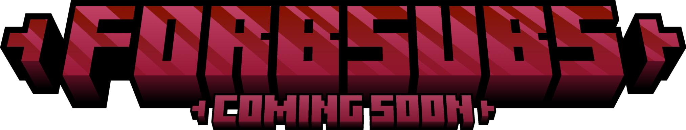

 

  

<h3 align="center">💎 A Minecraft mod about sussy substances and other ~~definitely legal~~ things! ⚗️</h3>
  

     
    <a href="https://github.com/The-Encryption/ForbSubs_The_Mod/issues">Report Bug</a>
    ·
    <a href="https://github.com/The-Encryption/ForbSubs_The_Mod/issues">Request Feature</a>
  

<!-- ABOUT THE PROJECT -->
## About The Mod

This mod was inspired by several other creations, such as Create: Broken Bad 🥽, Alcocraft 🍺, etc., as well as some TV and YT series and Encryption's particular interest in chemistry.
LEGAL substances await you 💊!

More details [here](https://app.milanote.com/1RoK7X18EEPFar/fs?p=G0FcgqI7FtW).

### Installation

The mod is still in development, so it hasn't been fully released yet. However, pre-releases and betas will be available [here](https://github.com/The-Encryption/ForbSubs_The_Mod/releases).

<!-- FEATURES -->
## Features

Here's what the mod has to offer at the moment:

- **Crimson materials**: Find those gems in structures above the Nether roof. You can powder them to make a toxic dust!

- **Revolver**: This weapon is not only useful for combat, it's also useful for gambling! Take turns shooting each other in a game of Russian Roulette.

- **Crimson Boiler**: This block can be used for making alcohol and tobacco. It also happens to be capable of reaching immensely high temperatures, and thus, is quite useful for cooking and smelting stuff.

- **Crimson Forge**: This block can be used to forge advanced items from the mod, including (planned) armour set materials and Medallions.

<!-- ISSUES -->
## Issues

See the [open issues](https://github.com/The-Encryption/ForbSubs_The_Mod/issues) for a full list of known issues.

<!-- CONTRIBUTING -->
## Contributing

Any contributions you make are **greatly appreciated**.

If you have a suggestion to make this mod better, please create an [issue](https://github.com/The-Encryption/ForbSubs_The_Mod/issues) with the tag "enhancement."
Don't forget to give the project a star! Thanks again 🤗!

<!-- LICENSE -->
## License

Distributed under the MIT License. See `LICENSE.txt` for more information.

<!-- CONTACT -->
## Contact

**Discord Server**:
https://discord.gg/2MUPhvXzna
**Website:**
https://encryption-business.ddns.net/

Feel free to join us!

**Project Link**: https://github.com/The-Encryption/ForbSubs_The_Mod
